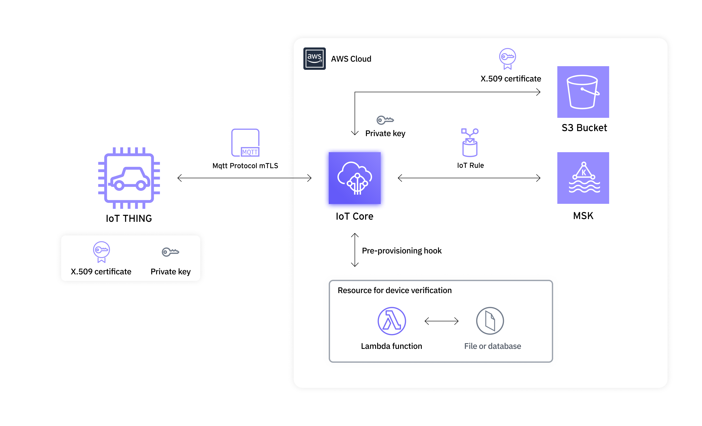

# Introduction
CASE, the mega-trend keyword for the automotive industry, can be summarized as Connectivity, Autonomous, Sharing, and Electrification.
Among them, connectivity is the foundation that enables cars that are integrated with IT technology to develop into living spaces that are connected to the world and move, and to provide various mobility services.
As the number of connected vehicles in mobility services increases rapidly, fleet management systems (FMS) need to be configured to meet various needs.
In this post, we'll share how 42dot addressed these challenges with AWS IoT Core and AWS CDK.

## About 42dot
42dot is the Global Software Center of Hyundai Motor Group, realizing freedom of movement in a connected world where everything moves by itself through software-defined vehicles (SDVs) based on service-defined and safety-designed values.
42dot developed AKit, an integrated solution for implementing autonomous driving technology, and TAP!, an integrated platform for autonomous mobility, and obtained the first autonomous driving paid transportation license in Korea.
Currently, it operates an integrated autonomous transportation service in Sangam and Cheonggyecheon, Seoul, where anyone can call not only 42dot's autonomous vehicles but also autonomous vehicles from various companies through the TAP! application.
42dot is leveraging AWS IoT to easily and securely connect and manage its fleet management system (FMS) vehicle devices to the cloud. It is using AWS CDKs as coded infrastructure tools to automate the deployment of IoT infrastructure for different requirements.

## Introduction to AWS IoT Core
AWS IoT Core is an AWS IoT service that allows you to connect and manage IoT devices and integrate with other AWS services.
AWS IoT Core provides the [IoT Device SDK](https://docs.aws.amazon.com/iot/latest/developerguide/iot-sdks.html), and devices developed based on it can easily use IoT Core.
IoT Core is responsible for communicating with devices and plays a central role in AWS IoT services, hence the word "Core". IoT Core provides message routing so that it can be used with storage like S3 and data pipelines like MSK.
You can also utilize services like [Greengrass](https://aws.amazon.com/greengrass/), [FleetWise](https://aws.amazon.com/iot-fleetwise/), and [SiteWise](https://aws.amazon.com/iot-sitewise/) that come with AWS IoT to increase the efficiency of operating and managing IoT devices.

## Introduction to CDK
The [AWS Cloud Development Kit](https://aws.amazon.com/cdk/) (hereafter AWS CDK) is an open source software development framework that allows you to define cloud application resources using familiar programming languages.
This approach to managing infrastructure through code is called Infrastructure as a Code, or IaC for short.
The CDK creates the resources by converting all written code into [CloudFormation](https://aws.amazon.com/cloudformation/) templates.
For those looking to implement IaC for the first time on AWS, the CDK provided by AWS is a great first point of departure.

# Prerequisites
[An AWS Account](https://console.aws.amazon.com/console/home)

[npm](https://www.npmjs.com/get-npm)
   - You can install the CDK via npm.

[AWS CDK](https://docs.aws.amazon.com/cdk/latest/guide/getting_started.html), [AWS IoT Core](https://aws.amazon.com/iot-core/getting-started/?nc=sn&loc=5&dn=1)
   - This article explains how to apply CDK to build IoT Core infrastructure. For basic usage of CDK and IoT, please refer to the above link.

[Provisioning of IoT Core](https://docs.aws.amazon.com/iot/latest/developerguide/iot-provision.html)
   - Refer to the above link for specific instructions on how to create certificates and policies required to use IoT Core.

[Setting tsconfig.json to use Json as a document type](https://www.typescriptlang.org/tsconfig#resolveJsonModule)
   - Please add the settings guided in the link to `tsconfig.json` in order to use Json files as objects within Typescript.

# Sample Scenario and System Architecture

The figure above shows a simple system architecture utilizing CDK. The behavioral scenario of this architecture is as follows.

> A device mounted on a vehicle sends vehicle data to the IoT Core using the MQTT protocol.
> After receiving the message, IoT Core forwards the message to MSK (Managed Streaming for Apache Kafka) through the Basic ingest function.

Basic ingest is one of the Message Routing features provided by IoT Core, which allows you to conveniently send messages to other AWS services without incurring messaging costs.
In this article, we will implement how to create a certificate and register it with IoT Core using the provisioning method of IoT Core, which is the provisioning method by claim, which is the method to use when it is difficult to provision unique credentials.

## Infrastructure required to implement the scenario
### Install CDK and bootstrap
Use th e code below to install the CDK and create a CDK project.

```
git clone https://github.com/aws-samples/42dot-cdk-fleetmanagement-system
cd 42dot-cdk-fleetmanagement-system
npm install
cdk --version
chmod +x start.sh
./start.sh
```

### Infrastructure Stacks
To implement the above architecture, we define the following two infrastructure resource stacks
`AwsVpcMskInfraStack`
A stack for declaring VPC, subnet, security group and MSK cluster.

`AwsIotCoreProvisioningInfraStack`
A stack for implementing a template for the enrollment of AWS IoT Things with claim certificates, the issuance of persistent certificates, and the accompanying provisioning service.
This stack also includes stack for issuing and storing claim certificates. The resulting certificate is shipped with the device firmware and requests the issuance and provisioning of a permanent certificate upon first use.

`AwsIotCoreRuleInfraStack`
A stack for forwarding and storing messages reported by devices.
This stack also defines an IoT Rule in IoT Core and set it up to forward messages to MSK via Basic ingest.


# Walkthrough

## Step 1: Creating VPC and MSK Cluster
In `AwsVpcMskInfraStack`
1. VPC Creation
   - Declares a VPC for use with MSK, configuring DNS support and instance tenancy, and assigns it tags based on configuration settings.
2. Subnets
   - Creates two private subnets within the VPC intended for the MSK cluster allocation.
3. Security Group
   - Establishes a security group for the MSK cluster, specifying ingress rules for communication within the cluster.
4. MSK Cluster
   - Utilizes the previously defined subnets and security group to declare the MSK cluster, setting up broker node group information, cluster name, Kafka version, and authentication methods.
5. Getting Bootstrap Brokers
   - Employs an AWS Lambda function to retrieve the bootstrap brokers information from the created MSK cluster.
   - This is facilitated by using a CustomResource from the aws-cdk-lib, making it straightforward to obtain this information.

## Step 2: Device Policy and Security Setup
In `AwsIotCoreProvisioningInfraStack`

1. Device Policy Customization
   - Modifies a predefined JSON policy ([`device/device-policy.json`](lib/device/device-policy.json)) based on configuration, creating an IoT device policy that allows topic publishing and subscription.
2. Lambda Role for Pre-Provisioning 
   - Establishes an IAM role with permissions for AWS Lambda to verify devices during the pre-provisioning phase.

## Step 3: Lambda Function and Provisioning Template
In `AwsIotCoreProvisioningInfraStack`

1. Pre-Provisioning Hook Lambda
   - Deploys a Lambda function ([`lib/lambda/verify-devices-lambda`](/lib/lambda/verify-devices-lambda.py)) to facilitate device verification, equipped with a specific IAM role and permissions to invoke the function from IoT.
2. Provisioning Template
   - Utilizes provisioning-template.json to define a provisioning template that includes the device policy and a pre-provisioning hook, enabling automated device provisioning.

## Step 4: Claim Certificate and Data Storage
In `AwsIotCoreProvisioningInfraStack`

1. S3 Bucket for Certificate Storage
   - Creates an S3 bucket to securely store claim certificates and keys, configuring it with strict access blocks and auto-deletion policies for security.
2. Claim Certificate Policy
   - Defines and applies a policy to allow certificate claims, ensuring devices can securely communicate with AWS IoT Core.
3. Certificate Generation and Storage
   - Uses AwsCustomResource to call the CreateKeysAndCertificate API, generating a claim certificate and storing it in the S3 bucket. The certificate is then linked to the policy, completing the provisioning process.

## Step 5. Declaring message transfer to MSK via AWS IoT Core Rule engine
In `AwsIotCoreRuleInfraStack`

1. IAM Role and Policy for Rule Engine:
   - Establishes an IAM role for the IoT Rule Engine, allowing it to route messages based on predefined rules.
   - A specific policy ([`lib/rule/rule-policy.json`](lib/rule/rule-policy.json)) grants necessary permissions for message forwarding to Amazon MSK.
2. Configuration of TopicRuleDestination:
   - Configures a TopicRuleDestination with security, networking settings (VPC, subnets, and security group), and associates it with the rule engine's IAM role, ensuring messages are securely routed to the correct MSK cluster.
3. Encryption Keys and Secret Management:
   - Utilizes AWS KMS to create encryption keys ([`lib/rule/key-policy.json`](lib/rule/key-policy.json)) for securing message content.
   - AWS Secrets Manager stores the MSK credentials, using the KMS key for encryption, to safely handle connection details to MSK.
4. IoT Core Rules for Message Routing:
   - Defines rules ([`lib/rule/rule-keys.json`](lib/rule/rule-keys.json)) in AWS IoT Core for routing messages to MSK topics.
   - Each rule specifies the SQL statement for message selection and the action to forward messages to MSK, including topic names and credentials fetched securely from AWS Secrets Manager.

## Step 6. Declaring the Stack in your app
Inside [`bin/cdk-test-project`](/bin/cdk-test-project.ts), declare the stacks we declared earlier - `AwsVpcMskInfraStack`, `AwsIotCoreProvisioningInfraStack`, `AwsIoTCoreRuleInfraStack`.

## Step 7. Deploy the stack
Having done that, you can try configuring it with the `AWS CloudFormation` template via the `cdk synth` command.

```
cdk synth
```

The `cdk diff` command allows you to compare previously deployed resources with those defined by the current code.

```
cdk diff
```

The `cdk deploy` command deploys the configured resource code to AWS CloudFormation and creates the resources in order.
You can optionally deploy one or all of the stacks.

```
cdk deploy # If there is only one stack
cdk deploy STACK_NAME # If you only want to deploy one specific stack among multiple stacks
cdk deploy --all # Deploy all multiple stacks
```

Now you're all set. When your IoT device sends a message in line with the `test-rule/${key}` topic,
AWS IoT forwards it directly to the `<test-msk-topic>.${key}` topic.
This ability to forward messages to other AWS services through a simple rule definition is called basic ingest.
The advantage of utilizing Basic ingest is that you are not charged for it, and there are no costs associated with forwarding messages to other AWS services.


# Cleaning up
To remove all stacks deployed so far, use the following command

 ```
./end.sh
 ```


# Conclusion
In this post, we've configured the infrastructure from device registration to data storage using IoT Core using CDK.
The CDK is a tool provided by AWS that guarantees high compatibility and can be a fundamental tool for building an AWS service-based architecture as an IaC.
IoT services have many components that need to be prepared in advance in the cloud infrastructure and are sensitive to change history because there are many decisions and changes that need to be made based on the behavior observed by equipment operators and service developers.
Managing this in code allows you to quickly deploy the infrastructure you need based on your environment and reduces human error.
This concludes the post.